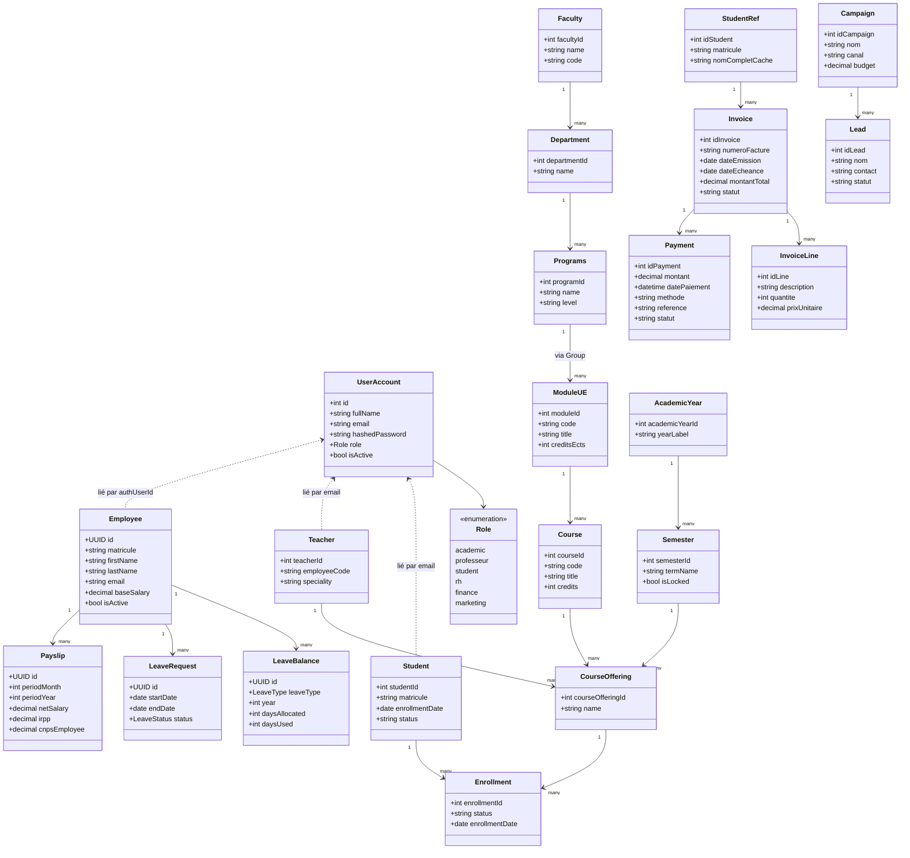

# Diagramme de classes

Reflète les classes de domaine réellement définies dans le code
(`app/models.py` de chaque service), regroupées par contexte borné
(bounded context = microservice). Les attributs listés sont un sous-ensemble
représentatif ; le code source reste la référence exhaustive.

## Notes de lecture
- Les liens en pointillés (`<..`) entre `UserAccount` (service Auth) et
  `Student` / `Teacher` / `Employee` (autres services) sont des références
  **logiques par email ou identifiant externe**, pas des clés étrangères
  SQL — chaque service possède sa propre base (pattern
  *database-per-service*, voir `docs/uml/deployment-diagram.md`).
- `StudentRef` (Finance) est une copie allégée de `Student` (Académique),
  volontairement dénormalisée pour éviter un appel synchrone
  inter-services à chaque facturation.
