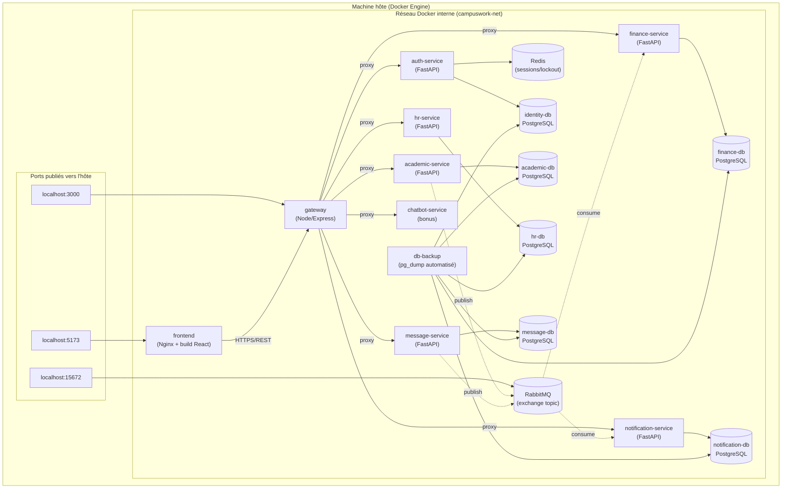

# Diagramme de déploiement

Représente la topologie réelle de `docker-compose.yml` : chaque
`subgraph` est un conteneur Docker (un "node" au sens UML déploiement),
sur le réseau Docker interne du projet. Seuls le `gateway` et le
`frontend` publient un port vers la machine hôte.

## Notes de déploiement
- **Isolation réseau** : les 6 bases PostgreSQL, Redis et RabbitMQ ne sont
  accessibles que depuis le réseau Docker interne — aucun port n'est
  publié vers l'hôte pour elles (sauf `15672`, la console d'admin
  RabbitMQ, utile en développement).
- **Pattern *database-per-service*** clairement visible : chaque service
  applicatif possède sa propre base, jamais partagée.
- **Le bus RabbitMQ (liens pointillés)** est le seul canal entre
  `academic-service` et `finance-service` (et entre `message-service` et
  `notification-service`) — aucune flèche synchrone directe entre ces
  paires, conformément à la contrainte architecturale de l'énoncé.
- **`db-backup`** (ajouté lors de cet audit — voir
  `docs/BACKUP_ET_PITR.md`) est le seul conteneur ayant un accès direct
  aux 6 bases pour les sauvegardes automatisées, indépendamment des
  services applicatifs.
