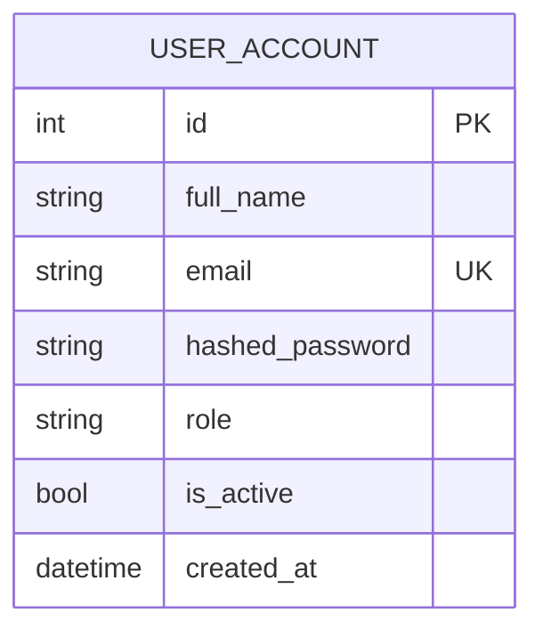

# Diagramme Entité-Association (ERD)

Le système suit le pattern **database-per-service** : il n'existe donc
**pas une seule base à modéliser, mais une par microservice**, sans clé
étrangère SQL entre elles (les liens inter-services sont logiques, portés
par un identifiant applicatif — voir `docs/uml/class-diagram.md`). Ce
document présente un ERD par base, normalisé à au moins la 3NF.

## 1. `identity_db` (auth-service)


Table unique, volontairement minimale — l'identité est le seul concept du
domaine Auth ; les autres services référencent `USER_ACCOUNT.email` ou
`.id` de façon logique (jamais de FK physique inter-bases).

## 2. `academic_db` (academic-service)

```mermaid
erDiagram
    FACULTY ||--o{ DEPARTMENT : contient
    DEPARTMENT ||--o{ PROGRAMS : propose
    PROGRAMS ||--o{ GROUP : "associe (n-n)"
    MODULE_UE ||--o{ GROUP : "associe (n-n)"
    MODULE_UE ||--o{ COURSE : regroupe
    ACADEMIC_YEAR ||--o{ SEMESTER : découpe
    COURSE ||--o{ COURSE_OFFERING : "est offert comme"
    SEMESTER ||--o{ COURSE_OFFERING : planifie
    TEACHER ||--o{ COURSE_OFFERING : enseigne
    CAMPUS ||--o{ COURSE_OFFERING : héberge
    STUDENT ||--o{ ENROLLMENT : "s'inscrit"
    COURSE_OFFERING ||--o{ ENROLLMENT : reçoit
    ENROLLMENT ||--o| GRADES : donne_lieu_a
    COURSE_OFFERING ||--o{ EXAM : programme
    CAMPUS ||--o{ BUILDING : contient
    BUILDING ||--o{ ROOM : contient
    COURSE_OFFERING ||--o{ CLASS_SCHEDULE : planifie
    ROOM ||--o{ CLASS_SCHEDULE : accueille
    STUDENT ||--o{ ATTENDANCE : "a une présence"
    CLASS_SCHEDULE ||--o{ ATTENDANCE : enregistre
    COURSE ||--o{ PREREQUISITE_COURSE : "exige (n-n)"

    FACULTY { int faculty_id PK, string name, string code }
    DEPARTMENT { int department_id PK, string name, int faculty_id FK }
    PROGRAMS { int program_id PK, string name, string level, int department_id FK }
    MODULE_UE { int module_id PK, string code UK, string title, int credits_ects }
    COURSE { int course_id PK, string code UK, string title, int credits, int module_id FK }
    TEACHER { int teacher_id PK, string employee_code UK, string speciality }
    STUDENT { int student_id PK, string matricule UK, date enrollment_date, string status, int program_id FK }
    ACADEMIC_YEAR { int academic_year_id PK, string year_label, date start_date, date end_date }
    SEMESTER { int semester_id PK, string term_name, bool is_locked, int academic_year_id FK }
    CAMPUS { int campus_id PK, string name, string city }
    BUILDING { int building_id PK, string name, int campus_id FK }
    ROOM { int room_id PK, string room_number, int capacity, int building_id FK }
    COURSE_OFFERING { int course_offering_id PK, string name, int course_id FK, int semester_id FK, int teacher_id FK, int campus_id FK }
    ENROLLMENT { int enrollment_id PK, string status, date enrollment_date, int student_id FK, int course_offering_id FK }
    GRADES { int grade_id PK, decimal score, int enrollment_id FK }
    EXAM { int exam_id PK, datetime exam_date, int course_offering_id FK }
    CLASS_SCHEDULE { int schedule_id PK, string day_of_week, time start_time, int course_offering_id FK, int room_id FK }
    ATTENDANCE { int attendance_id PK, bool present, int student_id FK, int schedule_id FK }
```

## 3. `finance_db` (finance-service)

```mermaid
erDiagram
    STUDENT_REF ||--o{ INVOICE : facture
    INVOICE ||--o{ INVOICE_LINE : détaille
    INVOICE ||--o{ PAYMENT : règle
    PAYMENT ||--o| RECEIPT : génère
    CAMPAIGN ||--o{ LEAD : produit

    STUDENT_REF { int id_student PK, string matricule UK, string nom_complet_cache }
    INVOICE { int id_invoice PK, string numero_facture UK, date date_emission, date date_echeance, decimal montant_total, string statut, int id_student FK }
    INVOICE_LINE { int id_line PK, string description, int quantite, decimal prix_unitaire, int id_invoice FK }
    PAYMENT { int id_payment PK, decimal montant, datetime date_paiement, string methode, string reference UK, string statut, int id_invoice FK }
    RECEIPT { int id_receipt PK, string numero_recu UK, int id_payment FK }
    CAMPAIGN { int id_campaign PK, string nom, string canal, decimal budget, date date_debut, date date_fin }
    LEAD { int id_lead PK, string nom, string contact, string source, string statut, int id_campaign FK }
```

`STUDENT_REF` est une copie dénormalisée et intentionnelle d'un
sous-ensemble de `STUDENT` (academic_db) — voir la note dans
`class-diagram.md`. Ce n'est pas une violation de la 3NF : c'est une
frontière de contexte borné assumée entre deux bases indépendantes.

## 4. `hr_db` (hr-service)

```mermaid
erDiagram
    EMPLOYEE ||--o{ LEAVE_BALANCE : possède
    EMPLOYEE ||--o{ LEAVE_REQUEST : soumet
    EMPLOYEE ||--o{ PAYSLIP : reçoit
    EMPLOYEE ||--o{ ATTENDANCE_HR : pointe

    EMPLOYEE { uuid id PK, string auth_user_id, string matricule UK, string first_name, string last_name, string email UK, string department, decimal base_salary, bool is_active }
    LEAVE_BALANCE { uuid id PK, string leave_type, int year, int days_allocated, int days_used, uuid employee_id FK }
    LEAVE_REQUEST { uuid id PK, date start_date, date end_date, string status, uuid employee_id FK }
    PAYSLIP { uuid id PK, int period_month, int period_year, decimal net_salary, decimal irpp, decimal cnps_employee, uuid employee_id FK }
    ATTENDANCE_HR { uuid id PK, datetime check_in_time, uuid employee_id FK }
```

## Justifications de conception (3NF)
- Aucune dépendance transitive : par exemple, `COURSE_OFFERING` ne stocke
  pas le nom du département (dérivable via `COURSE → MODULE_UE →
  PROGRAMS → DEPARTMENT`), évitant toute redondance mise à jour en
  plusieurs endroits.
- Les tables de jonction n-n (`GROUP` pour Programs↔ModuleUE,
  `PREREQUISITE_COURSE` pour Course↔Course) évitent les groupes de
  valeurs répétées.
- Les clés candidates naturelles (matricule, email, numéro de facture,
  référence de paiement) sont systématiquement contraintes `UNIQUE` en
  plus de la clé primaire technique auto-incrémentée/UUID.
