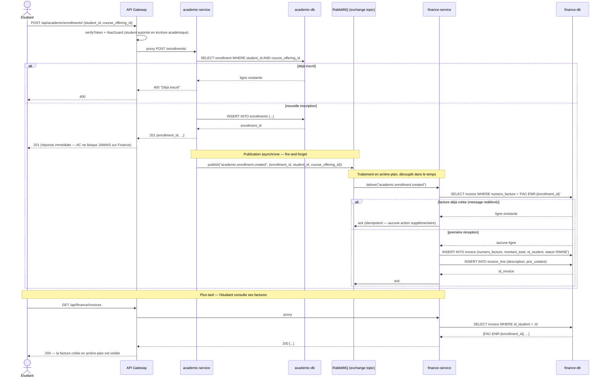

# Diagramme de séquence — Workflow asynchrone : inscription → facture

**C'est le diagramme exigé par l'énoncé** ("at least two sequence
diagrams, one covering the cross-service asynchronous workflow"). Il
couvre l'exemple donné explicitement : *"a new student enrollment
triggering a finance invoice"*, implémenté via RabbitMQ (exchange
`topic`) entre `academic-service` (producteur) et `finance-service`
(consommateur), sans appel HTTP synchrone entre les deux.

## Points clés démontrés par ce diagramme
1. **Découplage réel** : `academic-service` répond `201` à l'étudiant
   **avant** que `finance-service` ait traité l'événement — la latence de
   Finance n'affecte jamais le temps de réponse de l'inscription (mesuré
   dans `load-testing/RESULTS.md` : p95 ≈ 6,85–16,5 ms sur ce endpoint,
   indépendamment de la charge sur Finance).
2. **Idempotence** : si RabbitMQ redélivre le même message (ex : crash du
   consommateur avant l'`ack`), `finance-service` vérifie l'existence
   préalable de la facture avant d'en créer une — aucune facture en
   double, exigence explicite du cahier des charges.
3. **Aucun appel HTTP direct** entre `academic-service` et
   `finance-service` — seul le bus de messages les relie, ce qui satisfait
   la contrainte architecturale obligatoire de l'énoncé.
