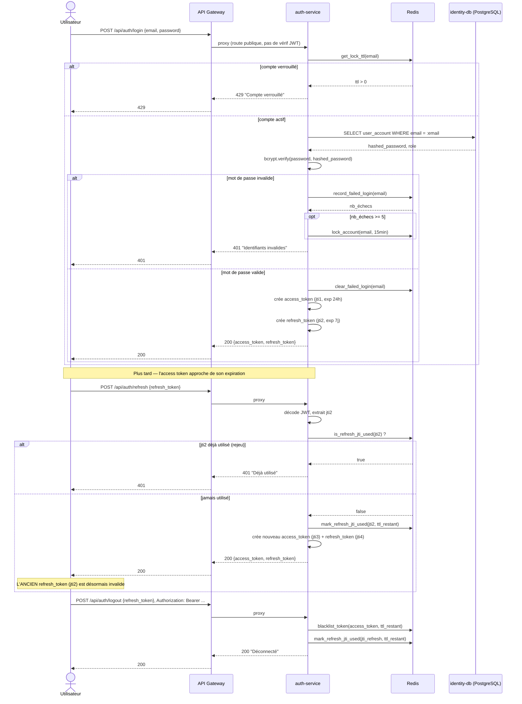

# Diagramme de séquence — Connexion et rotation du refresh token

Couvre `POST /auth/login`, `POST /auth/refresh` (avec rotation à usage
unique) et `POST /auth/logout`, tel qu'implémenté dans
`module_authentification/app/main.py`.

