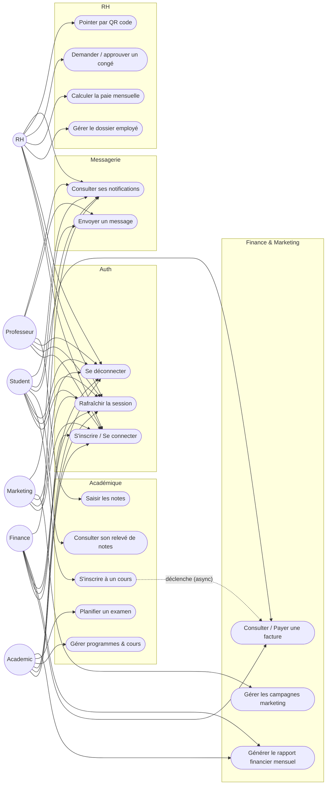

# Diagramme de cas d'utilisation

> Mermaid n'a pas de syntaxe UML "use case" dédiée — ce diagramme est
> rendu comme un graphe orienté (convention standard pour représenter des
> cas d'utilisation en Mermaid) : les acteurs sont à gauche, les cas
> d'utilisation sont les nœuds arrondis, regroupés par module (`subgraph`).

## Notes de lecture
- **UC5 → UC9** (pointillé "déclenche async") représente le flux
  transverse imposé par l'énoncé : une inscription réussie
  (`academic-service`) déclenche, via RabbitMQ, la création automatique
  d'une facture (`finance-service`) — voir
  [`sequence-enrollment-async.md`](./sequence-enrollment-async.md) pour le
  détail temporel de ce flux.
- Tous les rôles partagent les cas d'utilisation du module Auth (UC1-UC3)
  et de Messagerie (UC16-UC17), communs à toute l'application.
